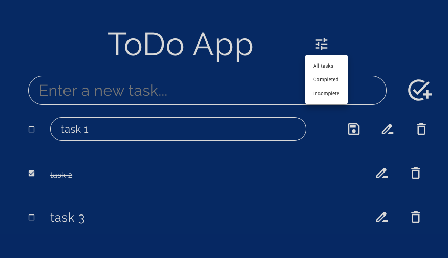

# Todo App (React TypeScript)

A simple Todo App built with React and TypeScript.

## Table of Contents

- [Description](#description)
- [Features](#features)
- [Demo](#demo)
- [Installation](#installation)
- [Usage](#usage)
- [Technologies Used](#technologies-used)
- [Contributing](#contributing)
- [License](#license)

## Description

The Todo App is a web application that allows users to create, manage, and organize their tasks using a simple and intuitive user interface. It is built using React and TypeScript, with features like task creation, task completion, task editing, and more.

## Features

- Create new tasks with task descriptions.
- Mark tasks as completed or incomplete.
- Edit task descriptions.
- Delete tasks.
- Filter tasks based on completion status.
- Responsive design for various screen sizes.

## Demo

You can try out the live demo of the Todo App at [https://todo-app-ts-mrg.vercel.app/](https://todo-app-ts-mrg.vercel.app/)

## Installation

1. Clone the repository: `git clone https://github.com/felipetexa/react-TS-todo-MRG.git`
2. Navigate to the project directory: `cd react-TS-todo-MRG`
3. Install dependencies: `npm install`

## Usage

1. Start the development server: `npm start`
2. Open your web browser and navigate to `http://localhost:3000` to access the app.
3. To run the server locally:
  - `cd todo-server`
  - `npx ts-node index.ts`
  - the server will be available at `http://localhost:5000` (the API_BASE_URL variable in `TodoContext.tsx` must be set to `http://localhost:5000` in order to make the API calls locally)

## Technologies Used

- React
- TypeScript
- Material-UI
- Styled Components

## Contributing

Contributions are welcome! If you find any issues or want to add new features, feel free to submit a pull request.

1. Fork the repository.
2. Create a new branch: `git checkout -b feature-name`
3. Make your changes and commit them: `git commit -m "Add feature"`
4. Push to the branch: `git push origin feature-name`
5. Submit a pull request.

## License

This project is licensed under the [MIT License](LICENSE).
